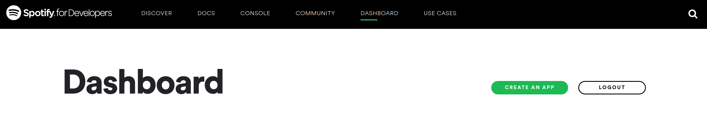
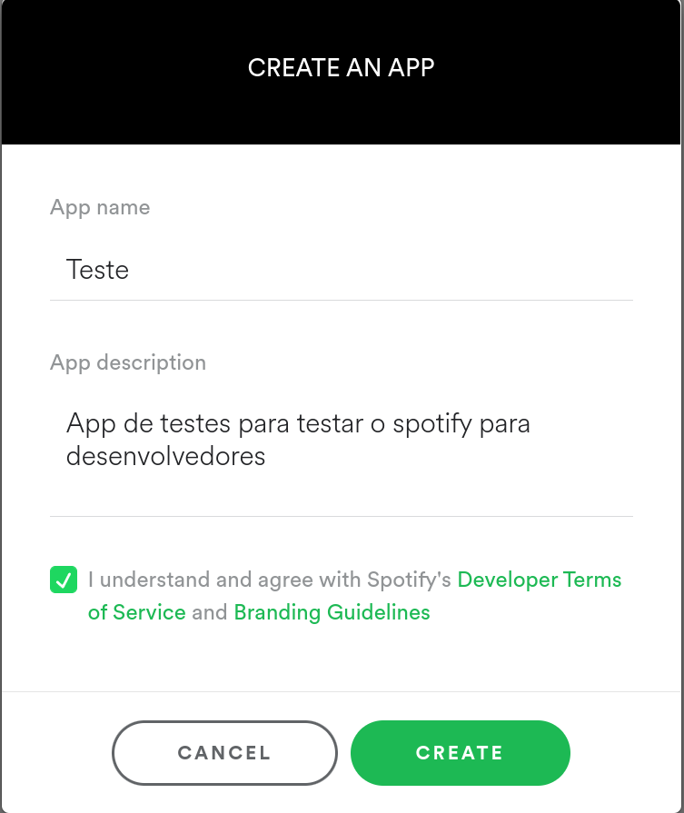
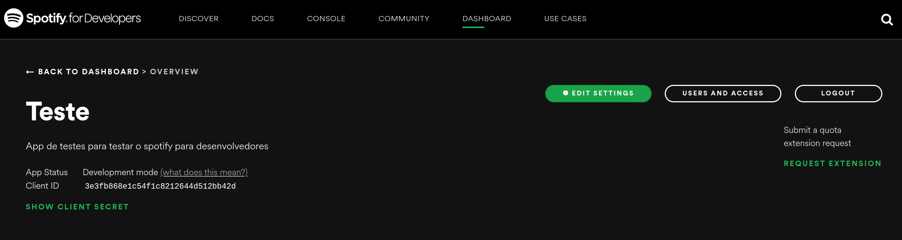
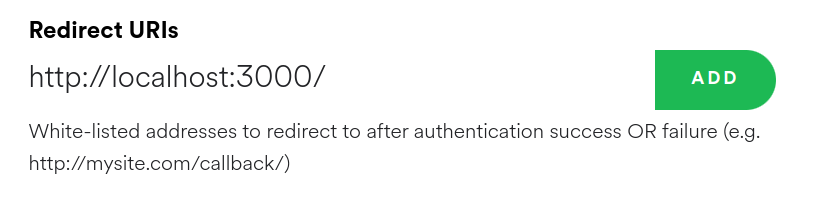

<h1 align="center"> SpotiPI </h1>


<p align="center"> SpotiPI é uma aplicação WEB para visualizar os principais dados retornados pela API pública do Spotify através de um design simples e moderno. </p>

# 📦 Instalação

### Criando aplicação
Para rodar a aplicação será necessário criar ou logar com uma conta no site de desenvolvedores do [Spotify](https://developer.spotify.com/dashboard/).
Depois de logado, basta clicar em "create an app".
<p align="center">
    
</p>

Para criar uma aplicação é necessário especificar um nome no campo "App name" e uma descrição em "App description", além de concordar com os termos de uso marcando a checkbox e por fim clicar em create.
<p align="center">
    
</p>


### Clonando repositório
Clonando o repositório utilizando ssh:
```bash
> git clone git@github.com:xRiku/spotipi.git
> cd spotipi
```

### Criação de credenciais
É necessário criar um arquivo .env na raíz do projeto com as seguintes variáveis: VITE_CLIENT_ID, VITE_CLIENT_SECRET, VITE_REDIRECT_URL.
Eles podem ser obtidos e definidos através do dashboard overview
<p align="center">
    
</p>
O clientID é mostrado abaixo de "App Status", além disso é possível obter o client secret clicando em "show client secret". Para definir o "redirect url" basta clicar em "⚙️ Edit Settings". Então um modal será aberto com um campo "Redirect URIs", no exemplo da imagem ele é preenchido com o endereço http://localhost:3000/
<p align="center">
    
</p>
Após definir um campo é necessário clicar em "ADD" e depois em "SAVE". 
<br></br>
🚨 <b>ATENÇÃO</b> 🚨
<br></br>
Se não clicar em "SAVE" as alterações não serão salvas e se preencher o campo, mas não clicar em "ADD" caso queira trocar o endereço de redirecionamento o endereço não será modificado. Redirect url é um endereço para o qual a aplicação redirecio após logar com o spotify.

### Execução
Instalando as dependências e rodando a aplicação utilizando yarn:
```sh
yarn
yarn dev
```

# Autores
👤 **Philipe Aguiar Marques**
- Github: [@xRiku](https://github.com/xRiku) 

👤 **João Felipe Gobeti Calenzani**
- Github: [@joaocalen](https://github.com/joaocalen) 
